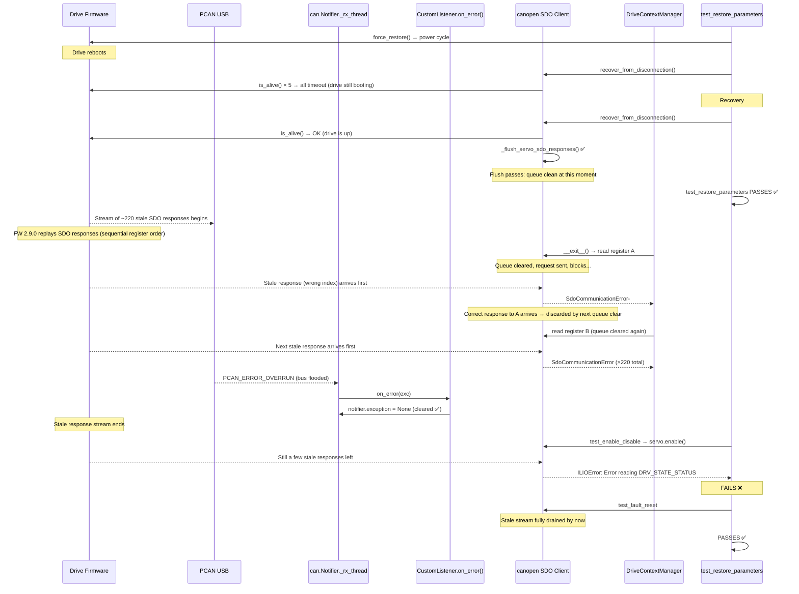

# INGK-1251 — Stale SDO Responses After Power Cycle on CANopen Capitan FW 2.9.0

## The Problem

`test_restore_parameters` (and subsequently `test_enable_disable`) fail intermittently on
**CANopen Capitan drives with firmware 2.9.0**. The failures do not occur with FW 2.4.0 or
on the Everest platform.

The test calls `DriveContextManager.force_restore()`, which triggers a **power cycle**
(store all → restore all → servo reboots). After the drive comes back online, SDO
communication is corrupted: the host receives responses that belong to requests issued
*before* the power cycle.

---

## Root Cause

### 1. Stale SDO responses after power cycle

When the drive power-cycles, the host calls `recover_from_disconnection()`, which resets
the CAN bus and polls `is_alive()` in a loop until the drive responds. During the window
where the drive is still booting, these `is_alive()` poll requests **time out on the host
side** — but the drive may still receive and queue them.

Once the drive finishes booting, it begins processing any SDO requests that arrived during
initialization. These **late responses** enter the CAN receive queue and are consumed by
the `canopen` SDO client as replies to *subsequent* requests. Because the SDO
index/subindex in the response doesn't match the current request, `canopen` raises:

```
SdoCommunicationError: Node returned a value for 0xXXXX:Y instead,
maybe there is another SDO client communicating on the same SDO channel?
```

### Not a simple cascade

The `canopen` SDO client (`SdoClient.request_response()`) **clears the response queue
before every request**:

```python
if not self.responses.empty():
    self.responses = queue.Queue()
```

This means a single stale response cannot cascade into subsequent reads — each read starts
fresh. For 220+ consecutive "wrong index" errors (as seen in the logs), there must be a
**continuous stream of stale SDO responses arriving** — one for each read, arriving fast
enough to beat the correct response into the queue.

The "wrong" response indices in the logs are sequential register addresses from the drive's
dictionary (`0x1602:2`, `0x5890:0`, `0x5891:0`, `0x5892:0`...). This pattern suggests the
firmware is replaying SDO responses for a bulk of registers in order — possibly responses
to the `DriveContextManager.__enter__()` reads that were queued internally in the firmware
before the power cycle and survive the reboot, or a FW 2.9.0-specific boot-up behavior.

> **Note:** The exact origin of the stale responses is not fully confirmed.
> They could be late responses to SDO requests sent during the recovery window,
> residual responses from pre-reboot SDO operations that survive in the firmware's
> internal queue, or a FW 2.9.0-specific boot sequence behavior.
> What *is* confirmed: the stale responses only appear on FW 2.9.0 (not 2.4.0), and
> only after a power cycle on the Capitan platform, suggesting the firmware's SDO server
> initialization behavior changed between versions.

If no response arrives at all (the stale response was consumed by a different request),
the client times out:

```
SdoAbortedError: Transfer aborted by client with code 0x05040000
```

### 2. PCAN buffer overrun

After recovery, `DriveContextManager.__enter__()` performs bulk reads of 200+ registers.
This flood of SDO requests can overwhelm the PCAN USB adapter, producing
`PCAN_ERROR_OVERRUN` ("The CAN controller was read too late").

In `python-can`, when `bus.recv()` raises an error inside `can.Notifier._rx_thread()`:

1. The exception is stored: `self.exception = exc`
2. `_on_error(exc)` is called — if a listener handles it, the thread keeps running
3. **But `self.exception` is never cleared**, even when `on_error()` handled it successfully

Then `canopen.Network.check()` — called on every `send_message()` — sees the stored
exception and re-raises it:

```python
if self.notifier.exception is not None:
    raise self.notifier.exception
```

Result: **every subsequent SDO operation fails** with the same already-handled error.

> This is a bug in `python-can` (tested 4.4.2) and `canopen` (tested 2.2.0).  
> Checked both upstream repositories (python-can `main`, canopen `master`) as of
> April 2026 — **neither has fixed this**.

---

## Fixes Applied

Six commits on branch `ingk-1251-investigate-restore-parameters-test-with-new-firmware-versions`:

### Commit 1 — `57a206b8` 
**Flush stale SDO responses after CANopen reconnection**

Added `_flush_sdo_responses()` called at the end of `recover_from_disconnection()`.
Drains the SDO response queue and performs a verification read to confirm communication
is clean.

### Commit 2 — `5c17f5eb` 
**Improve SDO flush: drain queue properly, loop with alternate register**

Improved the flush algorithm: drain → read alternate register (0x1018) → loop up to 10
iterations until clean.

### Commit 3 — `54bba2e4` 
**Add CustomListener for all CAN devices and settle delay in flush**

- Created `CustomListener(can.Listener)` with an `on_error()` handler to prevent the
  `can.Notifier` receive thread from dying on transient bus errors (PCAN overrun,
  IXXAT/KVASER error-limit errors).
- Registered it for **all CAN device types**, not just IXXAT/KVASER.
- Added 100ms settling delay between flush iterations.

### Commit 4 — `8cb6662b`
**Improve SDO flush: double-read verification with different registers**

Two consecutive SDO reads using **different** registers (Vendor ID `0x1018:01` +
Product Code `0x1018:02`). Both must succeed to consider the queue clean. Using different
registers prevents a stale response for register A from silently being accepted as a valid
reply for register B.

### Commit 5 — `de233421`
**Enable cron nightly builds on PR branches**

Removed the `BRANCH_NAME == "develop"` guard from the Jenkinsfile cron schedule so nightly
builds run on this branch (19:00 + 23:00 UTC daily, 08:00 + 14:00 UTC weekends).

### Commit 6 — `1ac3f7a2`
**Clear `notifier.exception` after `on_error` handles CAN bus errors**

`CustomListener.on_error()` now also clears `self._network.notifier.exception = None`.
This works around the `python-can` bug where the stored exception is never cleared after
being handled, causing `canopen.Network.check()` to re-raise it on every `send_message()`.

---

## Build-by-Build History (PR-776)

| Build | Result | What happened |
|-------|--------|---------------|
| #1 | SUCCESS | Non-nightly run; FW 2.9.0 stage not executed |
| #2 | ABORTED | Manually aborted |
| #3 | UNSTABLE | 3 failures (`test_enable_disable` ×2, `test_fault_reset`) — single-read flush was insufficient |
| #4 | ABORTED | Manually aborted |
| #5 | ABORTED | Manually aborted |
| #6 | **SUCCESS** | First all-green nightly after double-read flush (commit `8cb6662b`) |
| #7 | FAILURE | Infrastructure issue (Publish wheels / Unstash). No test failures. |
| #8 | SUCCESS | Non-nightly; FW 2.9.0 not executed |
| #9 | **SUCCESS** | All tests passed |
| #10 | UNSTABLE | 2 failures (`test_is_alive`, `test_status_word_wait_change`). PCAN overrun + `notifier.exception` never cleared → commit `1ac3f7a2` |
| #11 | **SUCCESS** | First build with `notifier.exception` fix |
| #12 | **SUCCESS** | All green |
| #13 | **SUCCESS** | All green |
| #14 | UNSTABLE | `test_enable_disable` ×1 (py3.10). Stale SDO in DriveContextManager exit. |
| #15 | UNSTABLE | `test_enable_disable` ×3, `test_fault_reset`. Also unrelated: Ethernet Everest FW 2.8.0 (47 tests, hardware). |
| #16 | UNSTABLE | `test_enable_disable` ×1. Also unrelated: EtherCAT Multislave PDO (3 tests). |
| #17 | UNSTABLE | `test_enable_disable` ×4 (all py versions). Also unrelated: EtherCAT Everest FW 2.8.0 (83 tests). |
| #18 | UNSTABLE | `test_enable_disable` ×1 |
| #19 | UNSTABLE | CANopen Cap 2.9.0: **PASSED**. Unrelated: EtherCAT Multislave PDO (3 tests). |
| #20 | UNSTABLE | `test_enable_disable` ×2, `test_fault_reset` |
| #21 | UNSTABLE | `test_enable_disable` ×1 |
| #22 | UNSTABLE | CANopen Cap 2.9.0: **PASSED**. Unrelated: EtherCAT Everest FW 2.8.0. |
| #23 | UNSTABLE | `test_enable_disable` ×3, `test_fault_reset`. Also unrelated: CANopen Everest FW 2.8.0 (48 tests). |

### Success Rates (builds 11–23, after all fixes)

| Stage | Runs | Passed | Failed | Rate |
|-------|------|--------|--------|------|
| CANopen Capitan FW 2.9.0 | 12 | 4 | 8 | **33%** |
| `test_restore_parameters` | 12 | **12** | 0 | **100%** |

### Unrelated Failures (infrastructure)

These failures affect other stages on different hardware/protocols and are **not related
to INGK-1251**:

| Stage | Builds affected | Nature |
|-------|-----------------|--------|
| EtherCAT Everest FW 2.8.0 | #17, #22 | Mass failure (80+ tests), hardware/infra |
| EtherCAT Multislave | #16, #19 | PDO-only failures (3 tests) |
| Ethernet Everest FW 2.8.0 | #15 | Mass failure (47 tests), network connectivity |
| CANopen Everest FW 2.8.0 | #23 | Mass failure (48 tests), hardware/connectivity |

---

## What's Fixed

**`test_restore_parameters` passes 100% of the time** (12/12 nightly runs after fixes).
The original INGK-1251 issue — stale SDO responses corrupting `is_alive()` checks during
`recover_from_disconnection()` — is resolved by the double-read verification flush.

---

## What's Still Failing

**`test_enable_disable` fails in ~67% of nightly runs** (8/12) on CANopen Capitan FW 2.9.0.

### Mechanism

The failure chain, confirmed from console logs of build #14 (py3.10):

1. `test_restore_parameters` triggers power cycle → `recover_from_disconnection()` runs
2. Our flush (`_flush_servo_sdo_responses`) clears stale SDO responses ✅
3. `test_restore_parameters` PASSES ✅
4. The test's `DriveContextManager.__exit__()` runs, attempting to restore ~200 registers
   that were saved during `__enter__()`
5. These 200+ SDO writes/reads encounter **residual stale responses** from the firmware
   that continued to arrive after the flush completed
6. **~220 "another SDO client" errors** are logged as `DriveContextManager` reads wrong
   responses for every register
7. `test_enable_disable` (the next test) calls `servo.enable()` → reads `DRV_STATE_STATUS`
   → gets a response for `0x6084:0` instead → **FAILS**

### Evidence from build #14 console (py3.10 session)

```
Line 4435:  test_restore_parameters PASSED           [ 63%]
Line 4437:  ERROR  Failed reading DRV_STORE_COCO_ALL. Exception: Node returned a value
            for 0x1A03:5 instead, maybe there is another SDO client...
  ... (~220 "another SDO client" errors — sequential register addresses) ...
Line 4684:  test_enable_disable
Line 4690:  ERROR  Failed reading DRV_STATE_STATUS. Exception: Node returned a value
            for 0x6084:0 instead, maybe there is another SDO client...
Line 4691:  FAILED                                    [ 87%]
Line 4694:  CAN bus error (handled, notifier kept alive): The CAN controller was read too late
Line 4700:  test_fault_reset PASSED                   [ 89%]
```

Key observations:
- `test_fault_reset` (immediately after) PASSES — the stale response stream has stopped
  by then.
- The "wrong" response indices are sequential dictionary addresses (`0x5890`, `0x5891`,
  `0x5892`...), suggesting the firmware is bulk-replaying SDO responses after boot.
- Since `canopen` clears the SDO queue before each request, these are NOT a one-off
  cascade — the firmware actively sends ~220 stale responses, one arriving per host read.

### Why the current flush doesn't prevent this

The flush runs inside `recover_from_disconnection()` and successfully verifies the SDO
queue is clean **at that moment**. The firmware starts sending its stream of stale
responses **after** the flush completes — possibly triggered by the flush reads themselves
or by the drive's internal post-boot SDO initialization.

From the build #14 logs (py3.10 session):

1. `17:25:17–19` — 5 SDO timeouts during `is_alive()` (drive still booting)
2. `17:25:19` — First recovery fails
3. `17:25:20.933` — Second recovery succeeds, flush passes ✅
4. `17:25:20.933` — **Same millisecond**: `DriveContextManager.__exit__()` starts reading
   registers and **immediately** encounters a stream of wrong responses

The flush's 100ms settle delay is not sufficient. The stale response stream may start
hundreds of milliseconds after the drive appears alive and the flush completes.

---

## What's Missing (potential next steps)

1. **Instrument SDO requests** — ✅ DONE. Added `SDOTracer` CAN listener that records
   every SDO request (TX) and response (RX) with timestamps, detects index mismatches
   and unsolicited responses. Hooks into `canopen.Network.send_message()` for TX capture
   and `can.Notifier` for RX capture. Automatically attached after every
   `recover_from_disconnection()` and reported on teardown or next recovery.

2. **Flush SDO responses after `DriveContextManager` exit** — run the flush *after* the
   bulk register restoration completes, not just after `recover_from_disconnection()`.

3. **Retry/re-flush inside `DriveContextManager.__exit__()`** — detect the "another SDO
   client" errors and trigger a secondary flush mid-restoration.

4. **Pace the bulk register reads** — add small delays between SDO operations in
   `DriveContextManager.__exit__()` to let the bus settle and reduce the chance of PCAN
   overrun and stale response collisions.

5. **SDO-level retry on stale response** — at the `canopen` SDO client level, if a
   response for the wrong index/subindex is received, discard it and retry instead of
   raising an error. This would be the cleanest fix but requires changes to `canopen`
   or monkey-patching.

6. **Upstream PR's** — file a bug/PR against `python-can` for the `notifier.exception`
   not being cleared after successful `on_error()` handling. File a similar one against
   `canopen` for the `check()` method not verifying whether the exception was already
   handled.

---

## Local Reproduction Tests (CAP-NET-C FW 2.10.0)

### Setup

- **Drive**: CAP-NET-C (originally said CAP-XCR-C, confirmed as NET-C)
- **Firmware**: 2.10.0.000 (newer than the 2.9.0 that shows the bug in CI)
- **Transceiver**: PEAK USB (PCAN_USBBUS1)
- **Node ID**: 32
- **Baudrate**: 1 Mbit/s
- **Dictionary**: `cap-net-c_can_2.9.0_v2.xdf` (2.9.0 dict works with 2.10.0)

### Test 1: Passive listener (reproduce_stale_sdo.py)

Clean disconnect → manual power cycle → passive CAN listening for 10s → reconnect.

| Metric | Result |
|--------|--------|
| Unsolicited SDO responses | **0** |
| Heartbeats | 1 (NMT boot-up) |
| Post-reconnect SDO mismatches | **0** |
| Reads OK / errors | 504 / 6 (write-only) |

### Test 2: CI recovery path (reproduce_ci_path.py)

Same network → restore → manual power cycle → `recover_from_disconnection()` → bulk read.

| Metric | Result |
|--------|--------|
| Recovery time | ~1.5s |
| SDO flush iterations | 1 (clean immediately) |
| Post-recovery SDO mismatches | **0** |
| is_alive() | True |
| SDOTracer: TX/RX frames | 507 / 507 (perfectly paired) |
| SDOTracer: mismatches | **0** |
| SDOTracer: unsolicited | **0** |

### Conclusion

**CAP-NET-C FW 2.10.0 does NOT reproduce the stale SDO response bug.** Three runs showed
zero SDO mismatches, zero unsolicited responses, and zero "another SDO client" errors.

Possible explanations:
1. **FW 2.10.0 fixed the issue** — the SDO server initialization changed between 2.9.0
   and 2.10.0
2. **Different hardware variant** — CAP-NET-C vs CAP-XCR-C may have different SDO behavior
3. **Timing differences** — manual power cycle is slower than CI's automated relay; the
   drive has more time to settle before recovery begins

**Next step**: push the SDOTracer instrumentation to Jenkins so the next nightly build on
**CAP-XCR-C FW 2.9.0** produces a detailed SDO traffic trace when the bug occurs.

---

## Architecture: Error Flow


