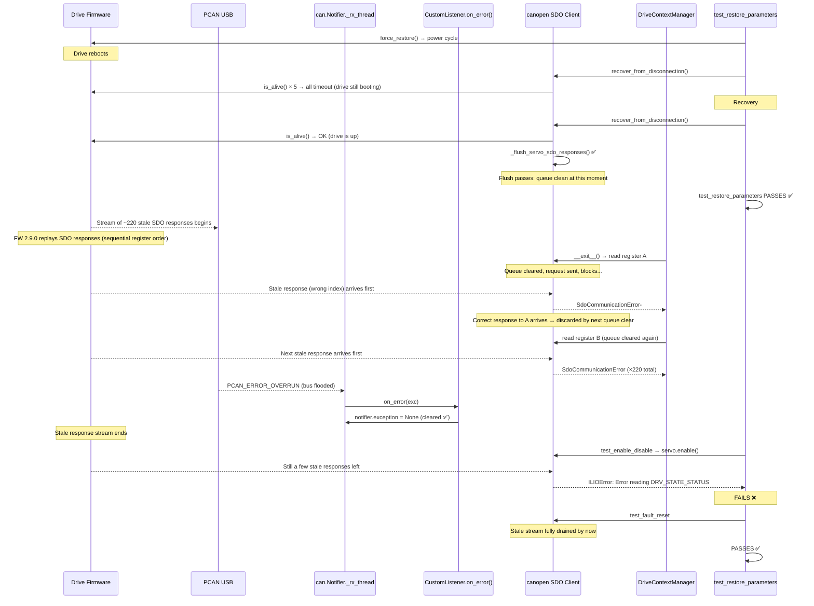

# INGK-1251 — Stale SDO Responses After Power Cycle on CANopen Capitan FW 2.9.0

## The Problem

`test_restore_parameters` (and subsequently `test_enable_disable`) fail intermittently on
**CANopen Capitan drives with firmware 2.9.0**. The failures do not occur with FW 2.4.0 or
on the Everest platform.

The test calls `DriveContextManager.force_restore()`, which triggers a **power cycle**
(store all → restore all → servo reboots). After the drive comes back online, SDO
communication is corrupted: the host receives responses that belong to requests issued
*before* the power cycle.

---

## Root Cause

### 1. Stale SDO responses after power cycle

When the drive power-cycles, the host calls `recover_from_disconnection()`, which resets
the CAN bus and polls `is_alive()` in a loop until the drive responds. During the window
where the drive is still booting, these `is_alive()` poll requests **time out on the host
side** — but the drive may still receive and queue them.

Once the drive finishes booting, it begins processing any SDO requests that arrived during
initialization. These **late responses** enter the CAN receive queue and are consumed by
the `canopen` SDO client as replies to *subsequent* requests. Because the SDO
index/subindex in the response doesn't match the current request, `canopen` raises:

```
SdoCommunicationError: Node returned a value for 0xXXXX:Y instead,
maybe there is another SDO client communicating on the same SDO channel?
```

### Not a simple cascade

The `canopen` SDO client (`SdoClient.request_response()`) **clears the response queue
before every request**:

```python
if not self.responses.empty():
    self.responses = queue.Queue()
```

This means a single stale response cannot cascade into subsequent reads — each read starts
fresh. For 220+ consecutive "wrong index" errors (as seen in the logs), there must be a
**continuous stream of stale SDO responses arriving** — one for each read, arriving fast
enough to beat the correct response into the queue.

The "wrong" response indices in the logs are sequential register addresses from the drive's
dictionary (`0x1602:2`, `0x5890:0`, `0x5891:0`, `0x5892:0`...). This pattern suggests the
firmware is replaying SDO responses for a bulk of registers in order — possibly responses
to the `DriveContextManager.__enter__()` reads that were queued internally in the firmware
before the power cycle and survive the reboot, or a FW 2.9.0-specific boot-up behavior.

> **Note:** The exact origin of the stale responses is not fully confirmed.
> They could be late responses to SDO requests sent during the recovery window,
> residual responses from pre-reboot SDO operations that survive in the firmware's
> internal queue, or a FW 2.9.0-specific boot sequence behavior.
> What *is* confirmed: the stale responses only appear on FW 2.9.0 (not 2.4.0), and
> only after a power cycle on the Capitan platform, suggesting the firmware's SDO server
> initialization behavior changed between versions.

If no response arrives at all (the stale response was consumed by a different request),
the client times out:

```
SdoAbortedError: Transfer aborted by client with code 0x05040000
```

### 2. PCAN buffer overrun

After recovery, `DriveContextManager.__enter__()` performs bulk reads of 200+ registers.
This flood of SDO requests can overwhelm the PCAN USB adapter, producing
`PCAN_ERROR_OVERRUN` ("The CAN controller was read too late").

In `python-can`, when `bus.recv()` raises an error inside `can.Notifier._rx_thread()`:

1. The exception is stored: `self.exception = exc`
2. `_on_error(exc)` is called — if a listener handles it, the thread keeps running
3. **But `self.exception` is never cleared**, even when `on_error()` handled it successfully

Then `canopen.Network.check()` — called on every `send_message()` — sees the stored
exception and re-raises it:

```python
if self.notifier.exception is not None:
    raise self.notifier.exception
```

Result: **every subsequent SDO operation fails** with the same already-handled error.

> This is a bug in `python-can` (tested 4.4.2) and `canopen` (tested 2.2.0).  
> Checked both upstream repositories (python-can `main`, canopen `master`) as of
> April 2026 — **neither has fixed this**.

---

## Fixes Applied

Six commits on branch `ingk-1251-investigate-restore-parameters-test-with-new-firmware-versions`:

### Commit 1 — `57a206b8` 
**Flush stale SDO responses after CANopen reconnection**

Added `_flush_sdo_responses()` called at the end of `recover_from_disconnection()`.
Drains the SDO response queue and performs a verification read to confirm communication
is clean.

### Commit 2 — `5c17f5eb` 
**Improve SDO flush: drain queue properly, loop with alternate register**

Improved the flush algorithm: drain → read alternate register (0x1018) → loop up to 10
iterations until clean.

### Commit 3 — `54bba2e4` 
**Add CustomListener for all CAN devices and settle delay in flush**

- Created `CustomListener(can.Listener)` with an `on_error()` handler to prevent the
  `can.Notifier` receive thread from dying on transient bus errors (PCAN overrun,
  IXXAT/KVASER error-limit errors).
- Registered it for **all CAN device types**, not just IXXAT/KVASER.
- Added 100ms settling delay between flush iterations.

### Commit 4 — `8cb6662b`
**Improve SDO flush: double-read verification with different registers**

Two consecutive SDO reads using **different** registers (Vendor ID `0x1018:01` +
Product Code `0x1018:02`). Both must succeed to consider the queue clean. Using different
registers prevents a stale response for register A from silently being accepted as a valid
reply for register B.

### Commit 5 — `de233421`
**Enable cron nightly builds on PR branches**

Removed the `BRANCH_NAME == "develop"` guard from the Jenkinsfile cron schedule so nightly
builds run on this branch (19:00 + 23:00 UTC daily, 08:00 + 14:00 UTC weekends).

### Commit 6 — `1ac3f7a2`
**Clear `notifier.exception` after `on_error` handles CAN bus errors**

`CustomListener.on_error()` now also clears `self._network.notifier.exception = None`.
This works around the `python-can` bug where the stored exception is never cleared after
being handled, causing `canopen.Network.check()` to re-raise it on every `send_message()`.

---

## Build-by-Build History (PR-776)

| Build | Result | What happened |
|-------|--------|---------------|
| #1 | SUCCESS | Non-nightly run; FW 2.9.0 stage not executed |
| #2 | ABORTED | Manually aborted |
| #3 | UNSTABLE | 3 failures (`test_enable_disable` ×2, `test_fault_reset`) — single-read flush was insufficient |
| #4 | ABORTED | Manually aborted |
| #5 | ABORTED | Manually aborted |
| #6 | **SUCCESS** | First all-green nightly after double-read flush (commit `8cb6662b`) |
| #7 | FAILURE | Infrastructure issue (Publish wheels / Unstash). No test failures. |
| #8 | SUCCESS | Non-nightly; FW 2.9.0 not executed |
| #9 | **SUCCESS** | All tests passed |
| #10 | UNSTABLE | 2 failures (`test_is_alive`, `test_status_word_wait_change`). PCAN overrun + `notifier.exception` never cleared → commit `1ac3f7a2` |
| #11 | **SUCCESS** | First build with `notifier.exception` fix |
| #12 | **SUCCESS** | All green |
| #13 | **SUCCESS** | All green |
| #14 | UNSTABLE | `test_enable_disable` ×1 (py3.10). Stale SDO in DriveContextManager exit. |
| #15 | UNSTABLE | `test_enable_disable` ×3, `test_fault_reset`. Also unrelated: Ethernet Everest FW 2.8.0 (47 tests, hardware). |
| #16 | UNSTABLE | `test_enable_disable` ×1. Also unrelated: EtherCAT Multislave PDO (3 tests). |
| #17 | UNSTABLE | `test_enable_disable` ×4 (all py versions). Also unrelated: EtherCAT Everest FW 2.8.0 (83 tests). |
| #18 | UNSTABLE | `test_enable_disable` ×1 |
| #19 | UNSTABLE | CANopen Cap 2.9.0: **PASSED**. Unrelated: EtherCAT Multislave PDO (3 tests). |
| #20 | UNSTABLE | `test_enable_disable` ×2, `test_fault_reset` |
| #21 | UNSTABLE | `test_enable_disable` ×1 |
| #22 | UNSTABLE | CANopen Cap 2.9.0: **PASSED**. Unrelated: EtherCAT Everest FW 2.8.0. |
| #23 | UNSTABLE | `test_enable_disable` ×3, `test_fault_reset`. Also unrelated: CANopen Everest FW 2.8.0 (48 tests). |
| #24 | ABORTED | Auto-triggered by SDOTracer commit, manually stopped |
| #25 | UNSTABLE | `test_enable_disable` ×1. **SDOTracer captured 743 stale SDO responses and 253 mismatches.** See "Jenkins Build #25" section. |

### Success Rates (builds 11–23, after all fixes)

| Stage | Runs | Passed | Failed | Rate |
|-------|------|--------|--------|------|
| CANopen Capitan FW 2.9.0 | 12 | 4 | 8 | **33%** |
| `test_restore_parameters` | 12 | **12** | 0 | **100%** |

### Unrelated Failures (infrastructure)

These failures affect other stages on different hardware/protocols and are **not related
to INGK-1251**:

| Stage | Builds affected | Nature |
|-------|-----------------|--------|
| EtherCAT Everest FW 2.8.0 | #17, #22 | Mass failure (80+ tests), hardware/infra |
| EtherCAT Multislave | #16, #19 | PDO-only failures (3 tests) |
| Ethernet Everest FW 2.8.0 | #15 | Mass failure (47 tests), network connectivity |
| CANopen Everest FW 2.8.0 | #23 | Mass failure (48 tests), hardware/connectivity |

---

## What's Fixed

**`test_restore_parameters` passes 100% of the time** (12/12 nightly runs after fixes).
The original INGK-1251 issue — stale SDO responses corrupting `is_alive()` checks during
`recover_from_disconnection()` — is resolved by the double-read verification flush.

---

## What's Still Failing

**`test_enable_disable` fails in ~67% of nightly runs** (8/12) on CANopen Capitan FW 2.9.0.

### Mechanism (Corrected — Build #25 Analysis)

The failure chain, confirmed from build #25 console logs with SDOTracer:

1. `test_restore_parameters` triggers `servo.restore_parameters()` → drive reboots
2. `environment.power_cycle(reconnect_drives=True)` calls `recover_from_disconnection()`
3. Recovery succeeds, `_flush_sdo_responses()` clears the SDO queue ✅
4. `test_restore_parameters` reads one register (`DRV_PROT_USER_OVER_VOLT`) → **succeeds**
5. `test_restore_parameters` **PASSES** ✅
6. STF `servo` fixture teardown: `has_power_cycle_happened=True` → calls
   `_force_context_manager_to_initial_state()` → `force_restore()` →
   `_store_register_data()` (bulk read of ~500 registers)
7. **~862ms after flush**: 743 stale SDO responses arrive from the PCAN USB adapter's
   internal buffer (confirmed by SDOTracer in build #25)
8. These stale responses corrupt the bulk reads: each `_store_register_data()` read gets
   a wrong-index response, raises `ILIOError`, which is caught with `continue` → register
   skipped. The errors appear in `------ live log setup ------` of SUBSEQUENT tests (not
   in `test_restore_parameters`'s own teardown — pytest logs them under the next test's
   fixture setup phase)
9. The stale response stream spans ~7 seconds (11:31:05.068 → 11:31:12.586), affecting
   the setup fixtures of `test_read`, `test_write`, `test_monitoring_*`,
   `test_disturbance_*`, each getting 4-65 register read failures
10. `test_enable_disable` (the next test) calls `servo.enable()` → reads
    `DRV_STATE_CONTROL` → gets a stale response for `0x2011:0` instead → **FAILS**

**Important correction**: The stale SDO errors do NOT happen in `DriveContextManager.__exit__()`.
They occur in `DriveContextManager.__enter__()` → `_store_register_data()` of the NEXT test's
fixture setup. The STF `servo` fixture (from `summit_testing_framework.fixtures.servo_fixtures`)
creates a new `DriveContextManager` per test with `scope="function"`.

### Error Handling in `_store_register_data()`

Two types of SDO errors occur, neither involves a timeout:

1. **Wrong-index response (fast, no timeout)**: When a stale response arrives before the
   real one, `canopen` detects the index mismatch and raises `SdoCommunicationError`
   immediately (< 1ms). `servo._read_raw()` logs `logger.error("Failed reading %s...")`
   then raises `ILIOError`. `_store_register_data()` catches `ILIOError` → `continue`.
   This is why bursts of 8-65 errors appear at the same millisecond.

2. **SDO timeout (`0x05040000`)**: Rare, only when a stale response was consumed by the
   previous request leaving no response for the current one. Costs 300ms per occurrence
   (`SdoClient.RESPONSE_TIMEOUT = 0.3`). The ~400ms gaps between test setup error bursts
   correspond to exactly one SDO timeout per `_store_register_data()` run.

### Evidence from build #25 (FW 2.9.0)

```
11:31:04.206  Recovery succeeds, flush passes, SDOTracer #2 attaches
11:31:05.068  test_restore_parameters PASSED [63%]
11:31:05.068  test_read setup — 8 "another SDO client" errors (same ms)
11:31:05.467  test_read PASSED
11:31:05.876  test_write setup — 8 errors
11:31:06.278  test_write PASSED
11:31:07.079  test_monitoring — 4 errors
11:31:08.328  test_monitoring — 7 errors
11:31:09.215  test_disturbance — 65+ errors (massive burst, same ms)
11:31:10.419  test_disturbance — 6 errors
11:31:11.217  test_disturbance — 4 errors
11:31:12.586  test_enable_disable — reads DRV_STATE_CONTROL → got 0x2011 → FAILED
11:31:17.235  SDOTracer #2: 253 mismatches, 743 unsolicited
```

### Why the current flush doesn't prevent this

The flush runs inside `recover_from_disconnection()` and successfully verifies the SDO
queue is clean **at that moment** (both verification reads succeed, no stale responses in
the python-side Queue). The 743 stale responses are still in transit through the lower
layers:

1. PCAN USB adapter's internal FIFO (not cleared by `disconnect()`/`connect()`)
2. USB driver buffer
3. OS kernel buffer

These layers deliver the stale frames to python ~862ms after the flush completes.
The SDOTracer proves this: all 743 unsolicited responses arrive at t=0.750s relative to
tracer attachment (which happens immediately after the flush).

---

## What's Missing (potential next steps)

1. **Instrument SDO requests** — ✅ DONE (build #25). SDOTracer confirmed 743 stale
   responses arriving 750ms after flush completes. Root cause: PCAN adapter FIFO not
   cleared on disconnect/reconnect.

2. **Fix the flush race condition** — The flush runs too fast (<100ms). Stale responses
   arrive ~750ms later from the PCAN adapter's internal buffer. Options:
   - **Option A**: Add a mandatory post-flush cooldown (2s) + second flush pass
   - **Option B**: Use a CAN bus listener to wait until no stale frames arrive for N
     seconds (adaptive, doesn't waste time when no stale responses exist)
   - **Option C**: Reset the PCAN adapter hardware (`CAN_Reset` / `CAN_Initialize`) to
     clear its internal FIFO before reconnecting
   - **Option D**: NMT Reset Communication to the drive — may abort queued SDO responses

3. **Fix SDOTracer false positive** — `_is_initiate_frame()` needs direction-awareness:
   SCS=1 (0x20-0x3F) is segment download response for RX, not initiate.

4. **SDO-level retry on stale response** — at the `canopen` SDO client level, if a
   response for the wrong index/subindex is received, discard it and retry instead of
   raising an error. This would be the cleanest fix but requires changes to `canopen`
   or monkey-patching.

5. **Upstream PR's** — file a bug/PR against `python-can` for the `notifier.exception`
   not being cleared after successful `on_error()` handling. File a similar one against
   `canopen` for the `check()` method not verifying whether the exception was already
   handled.

---

## Local Reproduction Tests (CAP-NET-C FW 2.10.0)

### Setup

- **Drive**: CAP-NET-C (originally said CAP-XCR-C, confirmed as NET-C)
- **Firmware**: 2.10.0.000 (newer than the 2.9.0 that shows the bug in CI)
- **Transceiver**: PEAK USB (PCAN_USBBUS1)
- **Node ID**: 32
- **Baudrate**: 1 Mbit/s
- **Dictionary**: `cap-net-c_can_2.9.0_v2.xdf` (2.9.0 dict works with 2.10.0)

### Test 1: Passive listener (reproduce_stale_sdo.py)

Clean disconnect → manual power cycle → passive CAN listening for 10s → reconnect.

| Metric | Result |
|--------|--------|
| Unsolicited SDO responses | **0** |
| Heartbeats | 1 (NMT boot-up) |
| Post-reconnect SDO mismatches | **0** |
| Reads OK / errors | 504 / 6 (write-only) |

### Test 2: CI recovery path (reproduce_ci_path.py)

Same network → restore → manual power cycle → `recover_from_disconnection()` → bulk read.

| Metric | Result |
|--------|--------|
| Recovery time | ~1.5s |
| SDO flush iterations | 1 (clean immediately) |
| Post-recovery SDO mismatches | **0** |
| is_alive() | True |
| SDOTracer: TX/RX frames | 507 / 507 (perfectly paired) |
| SDOTracer: mismatches | **0** |
| SDOTracer: unsolicited | **0** |

### Conclusion

**CAP-NET-C FW 2.10.0 does NOT reproduce the stale SDO response bug.** Three runs showed
zero SDO mismatches, zero unsolicited responses, and zero "another SDO client" errors.

Possible explanations:
1. **FW 2.10.0 fixed the issue** — the SDO server initialization changed between 2.9.0
   and 2.10.0
2. **Different hardware variant** — CAP-NET-C vs CAP-XCR-C may have different SDO behavior
3. **Timing differences** — manual power cycle is slower than CI's automated relay; the
   drive has more time to settle before recovery begins

**Next step**: push the SDOTracer instrumentation to Jenkins so the next nightly build on
**CAP-XCR-C FW 2.9.0** produces a detailed SDO traffic trace when the bug occurs.

---

## Jenkins Build #25 — SDOTracer Captures the Bug (2026-04-07)

### Setup

- **Build**: PR-776 #25, triggered manually with `test_session_filter=canopen_capitan`,
  `RUN_POLICY_NIGHTLY=true`, `PYTHON_VERSIONS=MIN`
- **Commit**: `c1e63fb8` — SDOTracer instrumentation added
- **Drive**: CAP-XCR-C (node 21), FW 2.9.0 (CI hardware)

### Results

| Stage | Status | test_restore_parameters | test_enable_disable |
|-------|--------|------------------------|---------------------|
| CANopen Capitan FW 2.4.0 | **SUCCESS** | PASSED | PASSED |
| CANopen Capitan FW 2.9.0 | **UNSTABLE** | PASSED | **FAILED** |

### SDOTracer Output — FW 2.4.0 (All Clean)

Three recovery cycles, all perfectly clean:

| Trace | TX | RX | Mismatches | Unsolicited |
|-------|----|----|------------|-------------|
| 1 (test_recover_from_disconnection) | 11,295 | 11,295 | 0 | 0 |
| 2 (test_store_parameters_timed_recovery) | 947 | 947 | 0 | 0 |
| 3 (test_enable_disable) | 9,746 | 9,746 | 0 | 0 |

**Total: 43,976 frames, 0 mismatches, 0 unsolicited.** FW 2.4.0 has no SDO desync.

### SDOTracer Output — FW 2.9.0 (Bug Captured!)

| Trace | TX | RX | Mismatches | Unsolicited | Notes |
|-------|----|----|------------|-------------|-------|
| 1 (test_restore_parameters) | 12,003 | 12,003 | **0** | 2* | *False positives — segment frames (see below) |
| 2 (test_enable_disable) | 10,192 | **10,935** | **253** | **743** | **THE BUG!** 743 excess RX |

### Detailed Analysis — Trace 2 (The Failing Test)

**Frame count**: 10,192 TX requests sent, **10,935 RX responses received** — **743 more
responses than requests.** These 743 excess responses are stale SDO replies from the
previous test session.

**Timing**: All 743 unsolicited responses arrive within the first **750ms** (t=0.750s)
after the SDOTracer attaches (which is immediately after `_flush_sdo_responses()` completes).

**First 10 unsolicited responses** (all at t=0.750s):
```
0x1600:1  raw=[43 00 16 01 10 00 40 60]  ← PDO mapping register
0x1600:2  raw=[43 00 16 02 00 00 00 00]
0x1600:3  raw=[43 00 16 03 00 00 00 00]
0x1600:4  raw=[43 00 16 04 00 00 00 00]
0x1600:5  raw=[43 00 16 05 00 00 00 00]
0x1600:6  raw=[43 00 16 06 00 00 00 00]
0x1600:7  raw=[43 00 16 07 00 00 00 00]
0x1600:8  raw=[43 00 16 08 00 00 00 00]
0x1601:0  raw=[4f 01 16 00 02 00 00 00]
0x1601:1  raw=[43 01 16 01 10 00 40 60]
```

All byte 0 = `0x43` or `0x4F` = SCS 2 (initiate upload response). These are well-formed,
complete SDO responses for sequential register addresses — exactly like the "another SDO
client" errors seen in previous builds.

**First 5 mismatches** (at t=0.750s):
```
sent 0x1A00:8, got 0x1600:0   ← off by one dictionary section
sent 0x1A01:0, got 0x1602:4   ← completely desynchronized
sent 0x1A01:1, got 0x1603:4
sent 0x1A01:2, got 0x1800:6
sent 0x1A01:3, got 0x1A00:6   ← response index close but wrong subindex
```

### Timeline — FW 2.9.0 Second Recovery (the failing one)

```
11:30:33  SDOTracer #1 attached (test_restore_parameters recovery)
11:30:48  test_restore_parameters starts reads
11:30:59  SDOTracer #1 report: 24,006 frames, all matched, 2 segment FP
11:31:02  ⚠ Recovery partially failed ("some servos still disconnected")
11:31:04  Recovery succeeded, flush runs → reports clean
11:31:04  SDOTracer #2 attached
11:31:05  ~750ms later: SDO mismatch errors begin flooding
11:31:05  "Failed reading CIA301_COMMS_TPDO1_MAP_8: got 0x1600:0 instead"
  ... 220+ "another SDO client" errors ...
11:31:12  test_enable_disable starts
11:31:12  "Failed reading DRV_STATE_CONTROL: got 0x2011:0 instead"
11:31:21  test_enable_disable FAILED
11:31:17  SDOTracer #2 report: 253 mismatches, 743 unsolicited
```

### Root Cause Confirmed: Flush Race Condition

The SDOTracer data definitively proves the failure mechanism:

1. **The flush succeeds** — `_flush_sdo_responses()` drains the python-side Queue and
   two verification reads pass. At this moment, the queue IS clean.

2. **Stale responses arrive 750ms later** — They are buffered in lower-level layers
   (PCAN USB adapter internal buffer → USB driver → OS kernel buffer) and take ~750ms
   to be delivered to the python-side Queue after the flush.

3. **The stale responses are from the previous test session** — Their indices
   (`0x1600:1-8`, `0x1601:0-1`, etc.) are sequential PDO mapping registers from the
   bulk reads performed by `DriveContextManager.__exit__()` after `test_restore_parameters`.

4. **743 excess responses corrupt all subsequent SDO communication** — Each new SDO
   request picks up a stale response instead of the real one, causing index mismatches
   that cascade through the entire test.

**Why the flush fails**: The flush runs in <100ms. The stale response buffer is 743 frames
deep. At CAN 1Mbit/s, one extended SDO frame takes ~130μs, so 743 frames take ~96ms to
transmit on the bus. But the bottleneck is NOT the bus — it's the PCAN USB adapter's
internal buffering and USB transfer latency. The adapter collects frames in its internal
FIFO and transfers them to the PC over USB in batches. After a `disconnect()` + `connect()`
cycle, the adapter's FIFO is NOT cleared. The 743 stale frames sit in the FIFO and are
delivered over USB after the connection is re-established, arriving ~750ms later.

### False Positive in SDOTracer (Minor Bug)

The 2 "unsolicited responses" in Trace 1 at t=10.938s are **false positives**:
```
0x58A4:0  raw=[20 a4 58 00 00 00 00 00]  ← byte 0 = 0x20 → SCS 1 → segment download response
0x58A4:0  raw=[30 a4 58 00 00 00 00 00]  ← byte 0 = 0x30 → SCS 1 (toggle bit)
```

`_is_initiate_frame()` checks `(data[0] >> 5) & 0x07 in (1, 2, 3, 4)`. For server (RX)
responses, SCS=1 (0x20-0x3F) is a segment download response — bytes 1-7 are data payload,
NOT index/subindex. The `0x58A4` "index" is actually segment data bytes misinterpreted.

**Fix needed**: `_is_initiate_frame()` should accept a `direction` parameter and use
different CCS/SCS sets for TX vs RX:
- TX (client): CCS ∈ {1, 2} = initiate (CCS 0 = segment, CCS 3 = block)
- RX (server): SCS ∈ {2, 3} = initiate (SCS 0, 1 = segment)
- Both: CCS/SCS 4 = abort (always has index/subindex)

---

## Architecture: Error Flow


