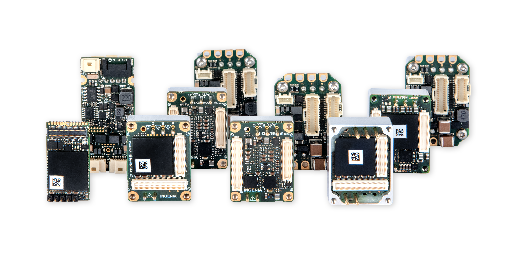

==================
ingenialink-python
==================

.. image:: https://img.shields.io/pypi/v/ingenialink.svg
    :target: https://pypi.python.org/pypi/ingenialink
    :alt: PyPI Version

.. image:: https://img.shields.io/badge/License-CC%20BY--NC--ND%204.0-lightgrey.svg
   :alt: CC by-nc-nd
   :target: https://creativecommons.org/licenses/by-nc-nd/4.0/legalcode

ingenialink-python is a Python library for simple motion control tasks and communication with Ingenia drives.

Requirements
------------

* Python 3
* WinPcap_ 4.1.3

.. _WinPcap: https://www.winpcap.org/install/

Development
^^^^^^^^^^^

In case that library will be use from source code the FOE application will be missing.
It must be added to ``ingenialink/bin/FOE/win_64x`` in order to use FOE feature.

Installation
------------

Installation is done by using ``pip``, i.e::

    pip install ingenialink

Documentation
-------------

For further details you can read the documentation_ where you will find
simple usage examples, the API docs, etc.

.. _documentation: https://distext.ingeniamc.com/doc/ingenialink-python/latest/
