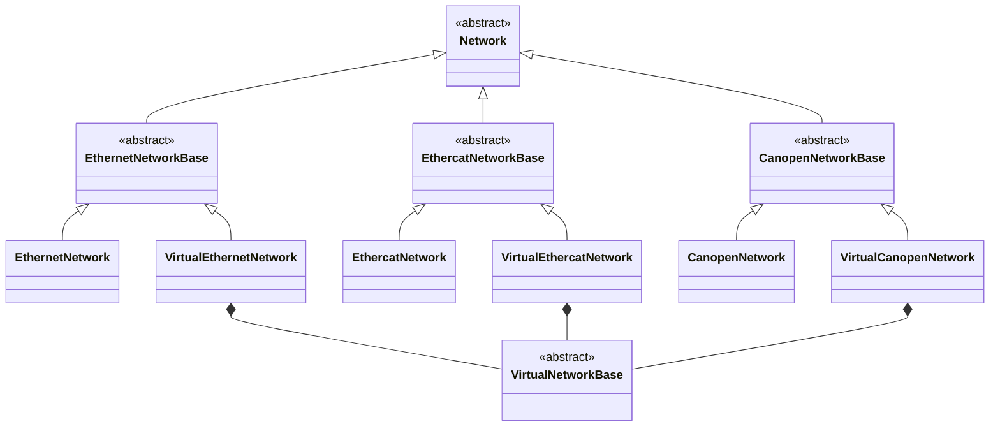

## Class Hierarchy (Network)

- **`Network` (base)**: Common API for connecting, scanning, and tracking devices.
- **`*NetworkBase` (protocol base)**: Shared protocol rules (what a “device” is, how to identify it).
- **`*Network` (real)**: Talks to real hardware and drivers.
- **`VirtualNetworkBase` (virtual common)**: Shared socket transport and virtual device registry.
- **`Virtual*Network` (virtual protocol)**: Protocol-specific virtual behavior and device creation (composes `VirtualNetworkBase`).