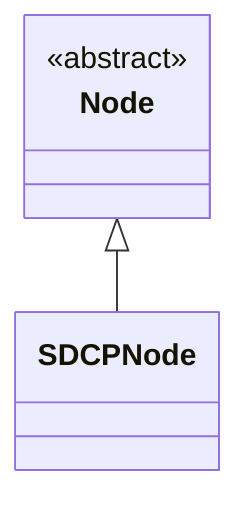

# Class Hierarchy (Node)

- **`Node` (base)**: Common API for representing a physical drive and managing its lifecycle.
- **`SDCPNode` (protocol node)**: SDCP-specific implementation for discovery updates, servo connections, disconnections, and TFTP firmware loading.