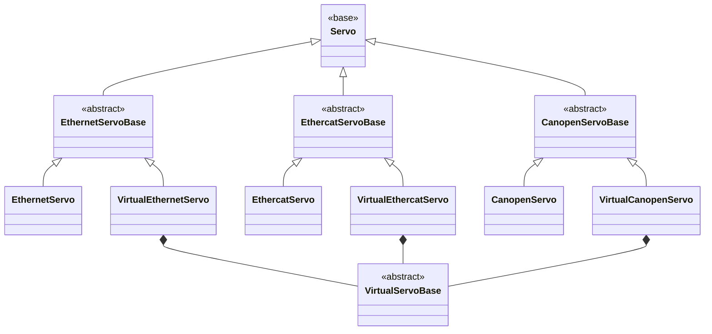

## Class Hierarchy (Servo)

- **`Servo` (base)**: Common API for reading/writing registers and device state.
- **`*ServoBase` (protocol base)**: Shared protocol rules for register access.
- **`*Servo` (real)**: Real hardware implementation.
- **`VirtualServoBase` (virtual common)**: Shared virtual device state + socket helpers.
- **`Virtual*Servo` (virtual protocol)**: Protocol-specific virtual behavior (composes `VirtualServoBase`).