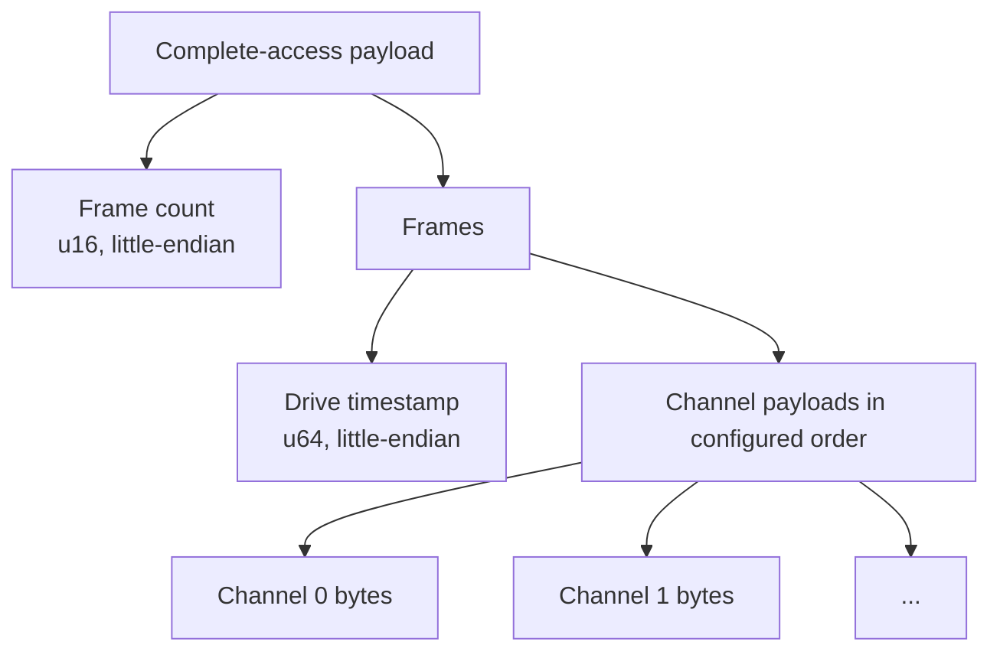
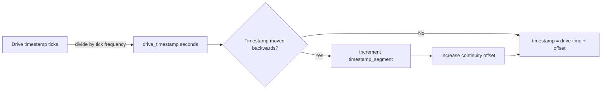
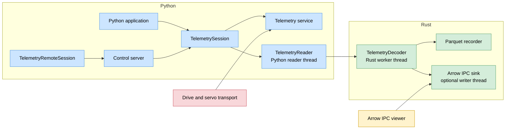
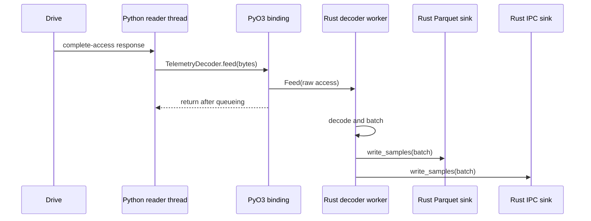
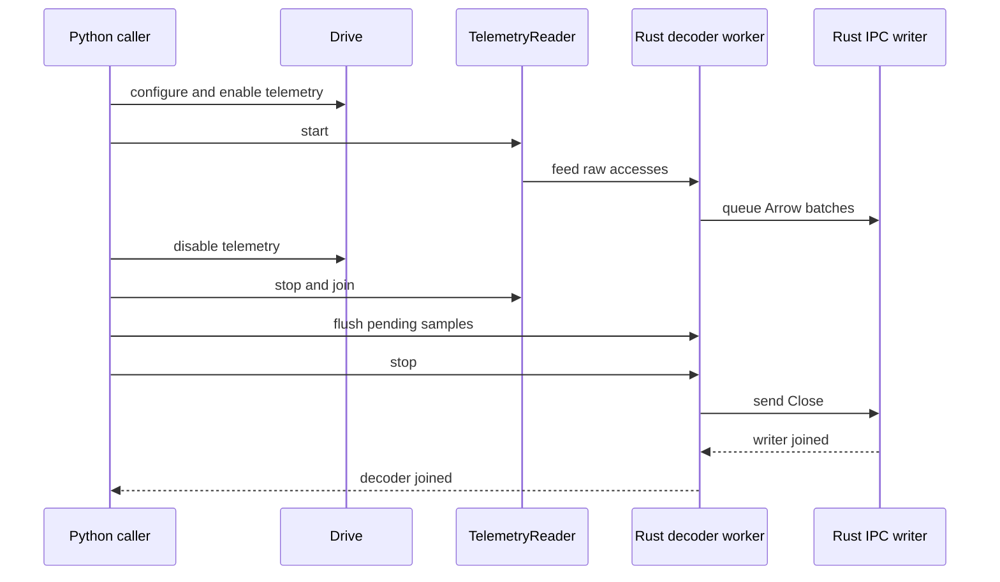

# Telemetry architecture

## What telemetry is

Telemetry is the drive-side mechanism for sampling several registers at a
configured rate and returning the samples as timestamped frames. It is used
when the application needs a time series of drive values—such as position,
velocity, current, or diagnostic signals—rather than occasional snapshots.

Normal register polling asks the host for the current value of one register at
the time of the request. Telemetry works differently:

1. The host configures a set of registers, called channels, in the drive.
2. The drive samples those channels at its own deterministic schedule.
3. The drive stores timestamped frames in a telemetry buffer.
4. The host periodically drains several frames with one complete-access read.

The sampling clock and timestamps therefore originate on the drive. Host
polling determines when buffered data is transferred, not when the samples were
created. This preserves the timing relationship between channels and avoids
making the sample rate dependent on network round trips or host scheduling.

## Channels and frame layout

A channel is one register selected for sampling. The drive samples all
configured channels together, so the values in one frame belong to the same
drive sampling instant.

For each channel, the telemetry configuration contains:

- the register mapping used by the drive;
- the register identifier, which becomes the output column name;
- the register data type, which determines the payload width and decoder;
- the byte order used to decode the payload.

The drive emits one complete-access payload containing a frame-count prefix and
zero or more fixed-width frames:



The payload offset of each channel is calculated from the configured data
types. Every frame therefore has the same size:

```text
frame_size = timestamp_size + sum(channel_byte_widths)
```

The decoder rejects truncated accesses, variable-width channel types, and
payloads that cannot be decoded using the configured channel types. Channel
values are decoded into native Rust values before they are sent to the sinks.

## Timestamp model

The drive timestamps samples; the host does not timestamp each sample when it
polls the buffer. This is important because a single host read can contain
many samples generated earlier on the drive.



For each frame:

1. The decoder reads the 64-bit drive tick count.
2. It converts ticks to seconds using the descriptor's
   `timestamp_frequency_hz`.
3. It stores that value in `drive_timestamp`.
4. It adds an offset to produce the normalized `timestamp`.

For the EtherCAT descriptor, the timestamp frequency is 1 MHz, so one tick is
one microsecond. The configured sample frequency is independent of this tick
frequency: the sample frequency controls how often frames are generated, while
the timestamp frequency controls how drive time is represented.

If the drive timestamp becomes smaller than the previous drive timestamp, the
decoder treats this as a reset, increments `timestamp_segment`, and adjusts the
offset so normalized timestamps remain continuous. This handles reconnects and
drive timestamp rollovers without hiding the reset: consumers can use
`timestamp_segment` to identify the discontinuity.

The timestamp fields have different meanings:

| Field | Clock | Meaning |
| --- | --- | --- |
| `drive_timestamp` | Drive clock | Raw drive timestamp converted from ticks to seconds. It can reset. |
| `timestamp` | Drive clock plus decoder offset | Continuous recording timeline derived from the drive timestamp. |
| `timestamp_segment` | Decoder state | Segment counter incremented when the drive timestamp moves backwards. |
| `host_time` | Host wall clock | Unix time captured when a Parquet batch is written. It is populated only on the first row of each Parquet batch. |

`host_time` is a batch-level wall-clock correlation point, not a per-sample
timestamp. The live Arrow IPC stream carries the `host_time` column for schema
compatibility, but its values are null.

Markers use the normalized `timestamp` timeline. If a marker has no explicit
timestamp, the latest decoded sample timestamp is used. Markers created after
a reconnect also include the connection epoch in Parquet metadata.

## Library implementation

The library implementation consists of:

- `Telemetry` for drive configuration and raw complete-access reads;
- `TelemetryReader` for background transport polling;
- Rust-backed `TelemetryDecoder` for frame decoding and batching;
- `TelemetryParquetRecorder` for Parquet output;
- `TelemetryArrowIpcSink` for live Arrow IPC output;
- `TelemetrySession` for recording lifecycle management;
- `TelemetryRemoteSession` for remote control and data streaming.

## Component flow



Python owns communication with the drive. Rust owns frame decoding, batching,
file output, streaming, metadata, and recording state.

The normal sample path is:

1. The drive places timestamped frames in its telemetry buffer.
2. `TelemetryReader` polls the drive through `Telemetry.read_access()`.
3. Each non-empty complete-access response crosses the Python/Rust boundary
   through `TelemetryDecoder.feed()`.
4. The Rust decoder worker decodes frames and accumulates samples until
   `batch_size` is reached.
5. The worker sends each batch to every attached sink.
6. The Parquet sink writes the batch to disk. The optional IPC sink queues it
   for the live Arrow client.

## Python/Rust boundary



`TelemetryDecoder.feed()` copies the raw access into a Rust message channel.
The Python reader therefore does not decode frames or write files. Decoding
and sink processing happen asynchronously on the Rust decoder worker.

Control operations such as `flush()`, `add_marker()`, and `stop()` send a
command to the same Rust worker and wait for its response. This serializes
control operations with pending sample processing and sink writes.

The important boundaries are:

| Boundary | Representation | Execution model |
| --- | --- | --- |
| Drive to Python | Complete-access response as `bytes` | Synchronous servo read issued by the Python reader thread. |
| Python to Rust | `TelemetryDecoder.feed(bytes)` | PyO3 copies the bytes into a Rust `Vec<u8>` and queues a decoder message. |
| Rust decoder to sinks | `DecodedSample` batches | In-process Rust trait calls on the decoder worker. |
| Rust to live viewer | Arrow IPC over TCP | The IPC sink queues batches for its writer thread. |
| Remote controller to Python | Newline-delimited JSON over TCP | Python control-server and per-connection handler threads. |

## Concurrency model

The Python reader thread polls the drive and queues raw accesses into the Rust
decoder worker. The decoder performs decoding, batching, and Parquet writes on
one Rust worker. If live streaming is enabled, the Arrow IPC sink has a
separate writer thread and bounded queue. A slow viewer can therefore lose
live batches without blocking Parquet recording.

`TelemetryRemoteSession` additionally runs a Python control-server thread and
one handler thread per control connection. Commands are serialized by the
remote session lock before they reach `TelemetrySession`.

There is no separate Parquet writer thread; Parquet writes run on the Rust
decoder worker.

## Lifecycle and shutdown order



`TelemetrySession.pause()` disables drive sampling, joins the Python reader,
and flushes pending Rust samples while keeping sinks open. `stop()` then closes
the decoder, which drains pending samples, closes the Parquet sink, closes the
IPC sink if enabled, and joins the Rust worker.

The remote session adds one outer layer: its control server can receive a
`pause` or `stop` command, but command execution is serialized by a Python
lock before it delegates to `TelemetrySession`.

## Drive-side configuration

`servo.telemetry()` returns a transport-specific telemetry service. The current
implementation provides this for EtherCAT; unsupported transports raise
`NotImplementedError`.

`Telemetry.configure()`:

1. Stops existing sampling.
2. Clears the mapped-register count.
3. Maps each selected register in payload order.
4. Configures the frequency divider and adaptive-rate flag.
5. Calculates the complete-access buffer size.
6. Returns the achieved sampling frequency.

Selected registers must contain telemetry mapping metadata from the dictionary.
The raw `read_access()` response starts with a little-endian frame count,
followed by timestamped frames.

## Recording lifecycle

`TelemetrySession` is the application-level coordinator:

```python
with TelemetrySession(
    servo,
    registers,
    "run.parquet",
    frequency=1_000,
    batch_size=1_000,
    adaptive_rate=True,
) as session:
    session.add_marker("motion-start")
    run_motion_test()
```

- `start()` configures the drive and starts the reader thread.
- `pause()` stops drive sampling and polling while keeping the Parquet writer
  open.
- A later `start()` resumes the same recording.
- `stop()` finalizes and closes the Parquet file.
- `rebind(new_servo)` switches to a replacement connection and creates a new
  timestamp segment.
- `add_marker()` stores marker metadata in the Parquet file.

If no poll interval is supplied, it is calculated from the drive buffer and
`buffer_fill_ratio` (default `0.5`). Transient register-access errors are
retried. The first unrecoverable reader or recorder error is exposed through
`session.error`.

## Output schema

Parquet and Arrow IPC use the same columns:

| Column | Meaning |
| --- | --- |
| `timestamp` | Host-normalized sample time in seconds. |
| `drive_timestamp` | Timestamp encoded by the drive frame. |
| `timestamp_segment` | Segment number used when drive timestamps reset, such as after reconnect. |
| `host_time` | Parquet: host Unix time captured at the beginning of a batch; later rows are null. Arrow IPC: null for all rows. |
| Register identifiers | Decoded channel values. |

Parquet metadata includes format version `2`, recording start time, drive
timestamp tick frequency, requested and achieved frequencies, and markers.
Markers are not included in the live Arrow IPC stream.

## Arrow IPC sink

`TelemetrySession` can publish decoded batches over TCP:

```python
session = TelemetrySession(
    servo,
    registers,
    "run.parquet",
    ipc_address="127.0.0.1:0",
)
session.start()
print(session.ipc_address)
```

Port `0` requests an available port. A consumer connects to
`session.ipc_address` and reads the stream using an Arrow IPC reader. The sink
uses a bounded, non-blocking queue. A slow live consumer may lose live batches,
while Parquet recording continues independently.

## Remote control

`TelemetryRemoteSession` is for deployments where one process owns the servo
connection and another process controls acquisition. It exposes a newline-
delimited JSON control socket and an Arrow IPC data socket.

```python
remote = TelemetryRemoteSession(
    servo,
    registers,
    "remote-run.parquet",
    control_address="127.0.0.1:0",
    data_address="127.0.0.1:0",
)
remote.start()
```

Supported control commands are:

- `configure` — select register identifiers and frequency;
- `start` — start acquisition;
- `pause` — pause acquisition while retaining the recording;
- `status` — return state and endpoint information;
- `add_marker` — add a Parquet marker;
- `stop` — finalize acquisition and close the session.

Example request sequence:

```json
{"id":1,"command":"configure","registers":["CL_POS_FBK_VALUE"],"frequency_hz":1000}
{"id":2,"command":"start"}
{"id":3,"command":"status"}
{"id":4,"command":"add_marker","label":"test-start"}
{"id":5,"command":"pause"}
{"id":6,"command":"stop"}
```
